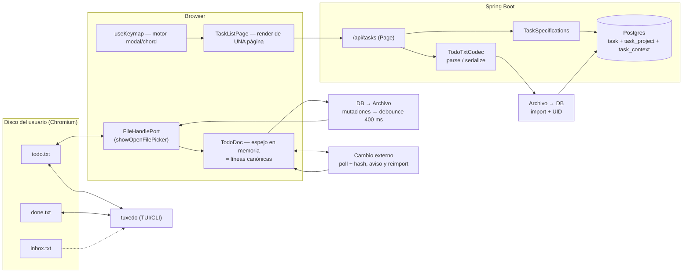

# Plan: compatibilidad KTLM ↔ [tuxedo](https://github.com/webstonehq/tuxedo)


> **Estado: Fase 0 COMPLETA (verificada en ejecución).** La tabla 0.1–0.7 se aplicó y se
> comprobó contra la app corriendo. Un hallazgo del smoke test se añadió sobre la marcha:
> un cuerpo con fecha malformada devolvía **500** y `GlobalExceptionHandler` no logueaba
> nada; ahora devuelve 400 y registra los no manejados. Ver "Registro de ejecución" al final.
Objetivo: que la app KTLM (Spring Boot + React) pueda **abrir un `todo.txt` real desde el disco**,
mantenerlo sincronizado en ambos sentidos con tuxedo, **paginar en servidor**, y exponer los
**mismos keybindings vim/chord** que tuxedo.

Decisiones ya tomadas por el usuario:

| Decisión | Valor | Consecuencia principal |
| --- | --- | --- |
| Topología de sync | Archivo local vía **File System Access API** (solo Chromium) | El navegador no tiene servidor de archivos; el `todo.txt` vive en la máquina del usuario. Fuera de Chromium hace falta un modo fallback. |
| Paridad de keybindings | **Núcleo + chords** | Se replica el motor modal/chord, no el TUI completo (temas, densidad, QR de captura y `rec:` builder quedan fuera). |
| Paginación | **Servidor** (`Spring Pageable`) | Hay que tocar repositorio, servicio, controlador, DTO de respuesta y cache key del frontend. |

> Nota de alcance: tuxedo instalado en esta máquina = `2026.8.1` (`/opt/homebrew/bin/tuxedo`).
> Este plan se escribió contra ese binario y contra el README/fuentes de `main`.

---

## 0. Hechos verificados (base del plan)

**tuxedo (referencia de formato y comportamiento)**

- Formato: línea plana. `(A)` = prioridad A–Z, `YYYY-MM-DD` = creación, `+proyecto`, `@contexto`,
  `key:value` (`due:`, `rec:`, `t:`, `note:`). Las tareas completas llevan `x ` + fecha de completado
  al inicio.
- Cualquier `key:value` desconocido **sobrevive al round-trip**; `hide_keys` solo lo oculta en pantalla.
  → es la ranura oficial para colgar metadatos propios.
- Numeración de tareas = **número de línea 1-based del archivo**, estable bajo filtro/orden.
- Escritura atómica: escribe `.tmp` y hace `rename`. Ante `NotFound` en disco, recarga como vacío.
- Detección de cambio externo: compara el **contenido completo** contra `last_disk` (no mtime).
  Un reload externo **borra el historial de undo**.
- Captura: `inbox.txt` hermano → `rename` a `.tuxedo-staging` → parseo → merge → escritura atómica →
  borrado de staging, todo bajo un lock consultivo (`*.tuxedo-lock`).
- Salida JSON del CLI (contrato útil para validar nuestro parser):
  `{"n":1,"raw":"...","done":false,"priority":"A","created":"2026-04-28","completed":null,
    "projects":["health"],"contexts":["phone"],"due":"2026-05-08","rec":null,"t":null}`

\*\*KTLM (estado actual, con rutas exactas)**

| Área | Estado actual | Fichero |
| --- | --- | --- |
| Entidad `Task` | `title @Size(max=100)`, `description @Size(max=500)`, `completed`, `priority LOW/MEDIUM/HIGH`, `dueDate LocalDateTime`, `sortOrder Integer` (nunca leído/escrito), `createdAt`, `updatedAt`, `userId` (escalar suelto, sin FK) | `backend/src/main/java/com/example/taskmanager/model/Task.java` |
| Sin DTO | Los controladores devuelven la entidad JPA cruda como request **y** response | `TaskController.java`, `AuthController.java` |
| Ownership | `GET/PUT/DELETE/PATCH /api/tasks/{id}` **no chequean propietario**; `GET /api/tasks` cae a `userId=1` si no resuelve el JWT | `TaskController.java` |
| Actualización parcial | `TaskService.updateTask` copia **solo** `title`, `description`, `completed` — descarta `priority`, `dueDate`, `sortOrder` | `TaskService.java` |
| Paginación | **Inexistente**. `TaskRepository` solo tiene `findByCompleted` y `findByUserId` | `TaskRepository.java` |
| Migraciones | Ninguna; `spring.jpa.hibernate.ddl-auto=update` | `application.properties` |
| Cliente API | `API_BASE` **hardcodeado** a `http://localhost:8080/api/tasks`, ignora `VITE_API_URL`; `api/client.ts` es **código muerto** sin importadores | `frontend/src/api/tasks.ts:3`, `frontend/src/api/client.ts` |
| Query | `queryKey: ['tasks']` plano, sin `staleTime`, sin `keepPreviousData`, mutaciones solo invalidan | `frontend/src/hooks/useTasks.ts` |
| Keybindings | 4 listeners sueltos de una sola tecla (`n`, `/`, `Esc`, rama muerta `1/2/3`), sin modo, sin chords, sin cursor de fila | `frontend/src/hooks/useKeyboardShortcuts.ts` |
| Filtro/búsqueda/orden | 100% cliente en un `useMemo` sobre el array completo | `frontend/src/pages/TaskListPage.tsx` |
| Tests backend | 1 archivo, 9 tests Mockito. Cero tests de controlador, cero de seguridad, cero de integración | `backend/src/test/.../TaskServiceTest.java` |
| Tests frontend | 2 archivos triviales (un smoke test, un render). E2E Playwright con `if (isVisible())` por todas partes | `frontend/src/**/__tests__`, `frontend/e2e/*.spec.ts` |

**Conclusión clave:** el tamaño de `title` (100) y el hecho de que `updateTask` descarte `priority`
y `dueDate` hacen que **importar un `todo.txt` real y usar `p` / `r` fallen hoy**. La Fase 0 no es
opcional.

---

## 1. Arquitectura objetivo



**Invariante único:** `TodoDoc` (memoria del cliente) ≡ contenido de `todo.txt` ≡ proyección en
`task`. Ninguna operación escribe en dos sitios sin pasar por `TodoDoc`.

**Quién gana en cada evento** (mismo criterio que `apply_external_state` de tuxedo):

| Evento | Ganador | Acción |
| --- | --- | --- |
| Mutación desde la app | La app | Patch en `TodoDoc` → mutación REST → flush atómico al archivo. |
| Edición externa (tuxedo, editor, sync) | El archivo | Se detecta por hash, se **revierte** la mutación en vuelo si no se aplicó, se reimporta y se avisa. |
| Error de lectura del archivo | Nadie | Se aborta la escritura; el estado en memoria se preserva (nunca se sobrescribe un archivo ilegible). |

---

## 2. Fase 0 — Saneo bloqueante

Sin esto, las fases siguientes producen datos corruptos o fugas.

| # | Cambio | Fichero | Motivo |
| --- | --- | --- | --- |
| 0.1 | Introducir `TaskRequest`/`TaskResponse` DTOs; dejar de exponer la entidad JPA | nuevo `dto/` | Hoy el cliente puede escribir `userId`, `createdAt`, `id`. |
| 0.2 | Subir `title` a `@Size(max=500)` y `description` a `@Size(max=4000)` | `Task.java:20-25` | Un cuerpo todo.txt real no cabe en 100 caracteres → el import devuelve 400. |
| 0.3 | `TaskService.updateTask` debe copiar `priority`, `dueDate`, `sortOrder` | `TaskService.java` | Sin esto `p` (prioridad) y `r` (reschedule) son no-ops silenciosos. |
| 0.4 | Chequeo de propietario en `GET/PUT/DELETE/PATCH /api/tasks/{id}`; borrar el fallback a `userId=1` | `TaskController.java` | IDOR: cualquier autenticado lee/edita tareas ajenas. |
| 0.5 | `dueDate`: `LocalDateTime` → `LocalDate` | `Task.java:32`, `TaskForm.tsx`, `types/task.ts` | `due:` es fecha civil; el `new Date(d).toISOString()` actual introduce desplazamiento UTC. |
| 0.6 | Unificar `API_BASE` en un solo módulo y **borrar** `api/client.ts` | `frontend/src/api/` | `client.ts` no tiene importadores; `tasks.ts` ignora `VITE_API_URL`. |
| 0.7 | `@JsonIgnore` en `User.password` | `User.java` | `GET /api/admin/users` devuelve el hash BCrypt. |

---

## 3. Fase 1 — Modelo de dominio todo.txt

### 3.1 Mapeo de campos

| todo.txt | `Task` (destino) | Nota |
| --- | --- | --- |
| `(A)` … `(Z)` | `priority` | `A→HIGH`, `B→MEDIUM`, `C→LOW`, resto `MEDIUM`. Sin `(x)` → `MEDIUM`. |
| `YYYY-MM-DD` (2.ª posición) | `createdAt` | Se conserva la **fecha**; la hora es irrelevante para el archivo. |
| cuerpo libre | `title` + `description` | El cuerpo no tiene límite real; por eso 0.2. |
| `+proyecto` | `task_project(project)` | `@ElementCollection`, como `User.roles`. |
| `@contexto` | `task_context(context)` | Igual. |
| `due:YYYY-MM-DD` | `dueDate` (`LocalDate`) | |
| `rec:[+]N{d,b,w,m,y}` | `recurrence` (`String`, nullable) | Se guarda literal; el motor lo interpreta. |
| `t:±N…` | `threshold` (`String`, nullable) | Umbral de aviso. |
| `x ` + fecha | `completed` + `completedAt` | `completedAt` **nuevo**, hoy inexistente. |
| `uid:<id>` | `uid` (`String`, nullable, indexado único) | **Clave del round-trip.** |
| otros `key:value` | `extras` (texto) | Se preservan literales. |

`uid` es el punto crítico de la compatibilidad: tuxedo conserva cualquier token `key:value`, así que
al escribir `uid:42` en cada línea el archivo sigue siendo un `todo.txt` válido para tuxedo, y el
import de vuelta reconoce la tarea sin duplicar. Se oculta con `hide_keys = uid` en
`~/.config/tuxedo/config.toml` (afecta solo al dibujo; el token sigue en disco).

### 3.2 Sin número de línea en la base de datos

El `n` de tuxedo es la posición en el archivo. No se persiste: se recalcula al serializar
(`TodoDoc` mantiene el orden). `sortOrder` deja de ser campo muerto y pasa a ser el **orden de
inserción dentro del archivo**, que es lo que `J`/`K` mueven y lo que `sort = file` respeta.

### 3.3 `TodoTxtCodec` (backend)

Una clase, `com.example.taskmanager.todotxt.TodoTxtCodec`, sin dependencias:

- `List<ParsedTask> parse(String body)` — una línea → `ParsedTask(priority, created, body, projects, contexts, due, rec, t, done, completed, uid, raw)`.
  Descarta líneas vacías y `# comentario` (mismo criterio que `drain_inbox`).
- `String serialize(List<ParsedTask>)` — orden de tokens fijo: `(P) created x completed  body  +proj  @ctx  due:  rec:  t:  uid:`.
- **Contrato de paridad**: tests que comparan contra la salida real de
  `tuxedo ls --json` y contra un `todo.txt` generado por `tuxedo add`, fijados como recursos de test.

### 3.4 Endpoints

| Método | Ruta | Body / Query | Respuesta |
| --- | --- | --- | --- |
| `POST` | `/api/tasks/import` | texto plano `text/plain` | `{ imported, updated, skipped, tasks[] }` |
| `GET` | `/api/tasks/export` | — | `text/plain`, el `todo.txt` completo del usuario |
| `POST` | `/api/tasks/archive` | — | mueve completadas a `done.txt` (espejo del `A`) |

`import` es **upsert por `uid`**, en una sola transacción, y devuelve el archivo reconciliado para
que el cliente lo escriba.

---

## 4. Fase 2 — Paginación en servidor

- `TaskRepository extends JpaRepository<Task, Long>, JpaSpecificationExecutor<Task>`.
- `TaskSpecifications`: `userId`, `completed`, `q` (title OR description, case-insensitive),
  `project`, `context`, `dueBefore/After`, `sortOrder` (`priority|due|file`).
- `GET /api/tasks?page=0&size=50&q=&filter=all&sort=priority&project=&context=` →
  ```json
  { "content": [TaskResponse], "page": 0, "size": 50,
    "totalElements": 0, "totalPages": 0, "hasNext": false }
  ```
- Reemplaza `getTasksByCompletionStatus(boolean)` (global, sin scope de usuario) — se elimina, no se
  reimplementa.
- Frontend: `queryKey: ['tasks', params]` con `placeholderData: keepPreviousData` para que la página
  no parpadee; `mutations` invalidan por prefijo (`['tasks']`).
- `Ctrl-d` / `Ctrl-u` dejan de ser "media pantalla" de scroll y pasan a **media página**, que es lo
  que hacen en tuxedo y lo que la paginación hace significativo.

---

## 5. Fase 3 — Espejo de archivo (File System Access API)

### 5.1 Puerto de archivo

`frontend/src/file/FileHandlePort.ts` con dos implementaciones:

- `FsaFileHandle` — `showOpenFilePicker` / `showSaveFilePicker`, con el permiso re-solicitado en cada
  `queryPermission`.
- `MemoryFileHandle` — fallback para Firefox/Safari y para Playwright (que no implementa la FSA API).
  La UI muestra un aviso explícito cuando corre en modo fallback: **el archivo no se sincroniza**.

```ts
interface FileHandlePort {
  open(): Promise<{ text: string; write(text: string): Promise<void> } | null>
  isPersistent: boolean
}
```

### 5.2 `TodoDoc`, el espejo

Store dedicado (`frontend/src/file/todoDoc.ts`), inicializado al abrir el archivo:

1. `text = await handle.text()`
2. `POST /api/tasks/import` → la DB queda alineada; se recibe el archivo reconciliado
3. `doc = parse(textReconciled)` y se guarda `lastDisk = textoDeDisco`

Mutación en la app = **patch de línea**, no reserialización completa:

- `x` → parchear la línea, `POST /api/tasks/{uid}/toggle`; si la tarea trae `rec:`, insertar la
  instancia siguiente con `due:` avanzado (mismo cálculo de tuxedo: con `+` anclado al `due` anterior,
  sin `+` desde la fecha de completado).
- `dd` → borrar la línea, `DELETE /api/tasks/{uid}`.
- `J`/`K` → mover la línea, `PATCH /api/tasks/{uid}/move` con el índice destino.
- Flush **debounced 400 ms** → `handle.write(serialize(doc))` con escritura atómica equivalente:
  como FSA no expone `rename`, se usa `createWritable({ keepExistingData: false })` + `write` +
  `close`, que es atómico a nivel de archivo en Chromium.

### 5.3 Detección de cambio externo

Réplica exacta de `apply_external_state`:

- `setInterval(400 ms)` (tuxedo usa ~250 ms en reposo) → `handle.text()`.
- Hash (FNV-1a sobre el string) distinto de `lastDisk` → **reload**: reimportar, refrescar la página
  actual, `toast` de aviso, y **descartar el historial de undo** local.
- Si el archivo ya no existe → estado vacío, sin crash.
- Si el `getFile()` falla por permisos → congelar escrituras y avisar; nunca escribir a ciegas.

### 5.4 Captura

`inbox.txt` hermano: la app lo lee en el mismo poll, aplica el mismo `TodoDoc` de merge y devuelve
las líneas canónicas. Es exactamente el punto de extensión que tuxedo ya expone (`echo "…" >> inbox.txt`
desde shell, Shortcuts de iOS, cron).

---

## 6. Fase 4 — Motor de keybindings

Sustituye `frontend/src/hooks/useKeyboardShortcuts.ts` (se borra, no se extiende).

```
frontend/src/keymap/
  actions.ts     → nombres de acción en snake_case, idénticos a tuxedo
  defaults.ts    → tabla por defecto, copia de la sección [normal] del keybinds.toml de tuxedo
  parseToml.ts   → parser del subconjunto TOML ([normal], string o array de string)
  useKeymap.ts   → máquina de estados: mode stack + leader armado + ventana de chord de 600 ms
  KeymapProvider.tsx
```

Requisitos del motor:

- **Pila de modos**: `normal → insert | search | visual | palette | prompt`, con `Esc` haciendo pop
  (equivalente a `escape_stack`).
- **Chords** con ventana de 600 ms e indicador en la barra de estado (`g…`, `d…`, `y…`, `f…`).
- **Normalización de teclas**: `event.key` → `Ctrl-n`, `Shift-Tab`, `Page-Up`, `F1`…`F24`.
- **Guardas**: se ignoran teclas con `metaKey`; `n` no dispara en un input (el hook actual solo
  protege `n`, y `/` y `Esc` secuestran teclas dentro de campos — bug a corregir).
- **Import de configuración real**: botón "Importar keybinds" que abre
  `~/.config/tuxedo/keybinds.toml` con la FSA. Si el usuario ya.customizó tuxedo, la web app usa
  **sus mismos atajos** sin duplicar configuración.

### Mapa de paridad (núcleo + chords)

| Acción | Tecla | Estado en KTLM hoy | Trabajo |
| --- | --- | --- | --- |
| `cursor_down` / `cursor_up` | `j` `k` / `↓` `↑` | — | cursor de fila + `Ctrl-d`/`Ctrl-u` por página |
| `cursor_top` / `cursor_bottom` | `gg` `G` | — | chord |
| `half_page_down/up` | `Ctrl-d` `Ctrl-u` | — | paginación |
| `begin_add` | `n` | ✅ existe | reutilizar `TaskForm` como overlay |
| `begin_edit_insert` / `_edit` | `i` / `e` | ❌ | `i` arranca en insert, `e` en normal |
| `toggle_complete` | `x` | ⚠️ solo con hover | **hoy las acciones son `opacity-0 group-hover`** → hay que hacerlas visibles para teclado |
| `delete` | `dd` | ❌ | chord + confirmación con `u` como salida |
| `cycle_priority` | `p` | ❌ | depende de Fase 0.3 |
| `move_task_down/up` | `J` `K` | ❌ | `sortOrder` |
| `reschedule` | `r` | ❌ | date picker |
| `begin_prompt_context` / `_project` | `c` / `+` | ❌ | `+` no es escribible en el TOML de tuxedo → mismo treatment |
| `copy_line` / `copy_body` | `yy` / `yb` | ❌ | `navigator.clipboard` + fallback `textarea.execCommand` |
| `undo` | `u` | ❌ | pila de 50 niveles, cliente |
| `begin_search` | `/` | ⚠️ roba `/` en inputs | grammar de `due:±Nw`, `rec:`, `t:` + texto libre |
| `pick_project` / `_context` / `_saved_filter` / `save_current_filter` | `fp` `fc` `ff` `fs` | ❌ | chord `f` con 600 ms |
| `cycle_sort` | `S` | ❌ | priority → due → file |
| `toggle_visual` / `toggle_selected` | `v` / `space` | ❌ | multi-select |
| `go_list` / `toggle_archive_view` / `archive_completed` / `toggle_show_done` | `l` `a` `A` `H` | ❌ | `A` escribe `done.txt` |
| `open_command_palette` | `:` `Ctrl-P` | ❌ | matcher fuzzy compartido con `/` |
| `open_help` | `?` | ❌ | overlay generado desde `defaults.ts` (una sola fuente de verdad) |
| `escape_stack` / `quit` | `Esc` / `q` | parcial ⚠️ | |

**Fuera de alcance por decisión**: `T` (temas), `D` (densidad), `L` (números de línea), `s` (QR de
captura), `[` `]` (sidebars), `o`/`O` (notas), constructor `rec:` modal. Se documentan como
extensiones futuras.

---

## 7. Fase 5 — Funcionalidades tuxedo adicionales

| Funcionalidad | Dónde vive | Nota |
| --- | --- | --- |
| Recurrencia (`rec:`) | backend `RecurrenceCalculator` | Al completar, inserta la siguiente instancia en la misma transacción. `u` deshace ambas. |
| Linguaje natural (`"Pay rent monthly on the first, show 3 days before due, project home"`) | `TodoTxtCodec` / `NaturalLanguageParser` | tuxedo lo llama desde `n` y desde el drain de `inbox.txt`; replicar la gramática completa es caro → **Fase 5.5, opcional**: empezar por fechas + `rec:` + `+proyecto`/`@contexto`. |
| Archivo y guardados (`fs`/`ff`) | `config.toml` local + `localStorage` | Los saved searches son `filter.<name> = <query>`, texto plano. |
| `done.txt` | Endpoint `archive` + FSA | Espejo del `A` de tuxedo. |
| `hide_keys = uid` | Config local de tuxedo | Documentarlo en el README del proyecto. |

---

## 8. Riesgos

| Riesgo | Impacto | Mitigación |
| --- | --- | --- |
| FSA API solo en Chromium | Firefox/Safari no pueden editar el archivo | `MemoryFileHandle` + aviso visible; la app sigue funcionando contra la API |
| La FSA no expone `rename` | No hay escritura atómica real | `createWritable()` es atómico en Chromium; documentar la diferencia |
| Playwright no soporta FSA | Los e2e no pueden probar el archivo | Tests de `TodoDoc`/`parseKeymap` en vitest; e2e de la parte de archivo vía `MemoryFileHandle` |
| Carrera entre tuxedo y la web | Pérdida de escrituras | Hash + reconciliación previa a cada mutación (igual que tuxedo) + aviso |
| `ddl-auto=update` sin migraciones | Columnas nuevas implícitas, sin rollback | Adoptar Flyway antes de la Fase 1 |
| Grow de `title` a 500 | Rompe `TaskCard` (trunca a 1 línea) | Ajustar render y el `line-clamp` |
| E2e actuales con `if (isVisible())` | No fallan nunca → no protegen nada | Reescribir las aserciones cuando se toca la lista |

---

## 9. Verificación por fase

Nunca cerrar una fase solo con tests unitarios: la prueba es el binario corriendo.

- **Fase 0**: levantar `docker compose up` + `npm run dev`; crear una tarea con prioridad `HIGH` y
  `dueDate`, editarla y confirmar que persiste (hoy falla).
- **Fase 1**: `tuxedo add "x +p @c due:2026-12-01"` → exportar desde `/api/tasks/export` →
  `diff` contra el archivo original → debe dar **cero diferencias**.
- **Fase 2**: 300 tareas, recorrer 6 páginas con `Ctrl-d`/`Ctrl-u`, medir que cada request devuelve
  ≤ `size` elementos.
- **Fase 3**: abrir un `todo.txt` real en Chromium, editar con `x`/`dd`/`p`, y en paralelo
  `watch -n 0.5 cat todo.txt` para ver la escritura; después editar desde `tuxedo` y comprobar el
  aviso de recarga.
- **Fase 4**: recorrer la tabla de paridad tecla por tecla con el driver real.
- **Fase 5**: `x` sobre una tarea con `rec:+1m` → comprobar la línea siguiente y que `u` deshace
  ambas.

---

## 10. Orden de ejecución

```
Fase 0 (saneo)  ── bloquea todo
   │
Fase 1 (modelo + codec + import/export)  ── bloquea la interoperabilidad real
   │
Fase 2 (paginación)  ── independiente de 1, puede solaparse
   │
Fase 3 (espejo de archivo)  ── necesita 1
   │
Fase 4 (keymap)  ── necesita 3 (las chords dependen de la fila cursor) y 2 (Ctrl-d/u)
   │
Fase 5 (recurrencia, done.txt, natural language)  ── opcional
```

Estimación de superficie: Fase 0 ≈ 7 ficheros tocados; Fase 1 ≈ 10 nuevos + 4 modificados;
Fase 2 ≈ 6; Fase 3 ≈ 7 nuevos; Fase 4 ≈ 8 nuevos (incluye el borrado del hook actual);
Fase 5 escalonado.

---

## 11. Preguntas abiertas (no bloquean el inicio)

1. ¿Se quiere que la web app **escriba también** `done.txt`, o `A` queda como operación exclusiva de
   tuxedo y la web solo lee?
2. ¿El `uid:` se escribe siempre, o solo cuando el archivo ya venía de otra fuente (para no
   contaminar un `todo.txt` del usuario en el primer guardado)?
3. ¿Se adopta Flyway en la Fase 0, o se acepta `ddl-auto=update` durante el desarrollo y se migra al
   final?

---

## 12. Registro de ejecución — Fase 0

Aplicada y verificada contra Postgres 18 local + backend en :8080 + Vite en :5173, con la
app real manejada en Chromium. Base de datos de prueba creada y eliminada al terminar.

| Cambio | Verificación observada |
| --- | --- |
| `title` 500 / `description` 4000 | `varchar(500)` en el esquema generado; POST de 250 caracteres → `201` |
| `TaskRequest` / `TaskResponse` | `userId:999` y `createdAt:1999-…` en el payload → la respuesta trae `createdAt` del servidor y el recurso queda del propietario real |
| `updateTask` parcial | `PUT` con solo `title` devolvió `priority:"HIGH"` y `dueDate:"2026-12-01"` intactos. **Repetido por la UI**: editar solo el título dejó la tarjeta en `Alta` / `1 dic` |
| Ownership en `/{id}` | Bob contra la tarea 1 de Alice: `GET/PUT/DELETE/PATCH` → `404` en los cuatro. Listas por usuario separadas |
| `dueDate` a `LocalDate` | `2026-10-06` creado desde la UI se renderiza **"Mañana"** tras recargar, no "Hoy" — sin desplazamiento UTC |
| `API_BASE` único | `api/client.ts` borrado (0 importadores); `tasks.ts` y `auth.ts` usan `api/http.ts` y respetan `VITE_API_URL` |
| `@JsonIgnore` en `password` | `GET /api/admin/users` ya no incluye el campo |
| *Hallazgo del smoke* | Fecha malformada `61007-02-20` → **500** silencioso. Ahora `400 {"error":"Bad Request"}`; `GlobalExceptionHandler` loguea lo no manejado |

Tests: backend 14/14 (`TaskServiceTest` reescrito con cobertura de payload parcial y de
ownership cruzado), frontend 4/4, `npm run build` OK.

### Deuda que queda anotada, no resuelta

- `useTasks` no tiene `onError`: un `400` se traga sin toast. No afecta a la corrección, pero
  en la Fase 3 el watcher del archivo necesita que los fallos sean visibles.
- ~~`ddl-auto=update` sin Flyway~~ → resuelto en la Fase 1 (ver §13).
- Los e2e de Playwright siguen con `if (isVisible())` en todas las aserciones.

---

## 13. Registro de ejecución — Fase 1

### Flyway

Adoptado. `V1__baseline.sql` reproduce el esquema que dejaba `ddl-auto=update`;
`V2__todotxt_columns.sql` añade los campos de todo.txt, las tablas de proyectos y contextos,
el índice por `user_id` y el índice único parcial de `todo_uid`.
`baseline-on-migrate=true` + `baseline-version=1` deja las bases preexistentes en V1, de modo
que solo ejecuten lo nuevo. `ddl-auto` pasa a `validate`: Hibernate comprueba, Flyway manda.

Verificado en una base vacía: `Successfully validated 2 migrations` → `Migrating to "1 - baseline"`
→ `Migrating to "2 - todotxt columns"` → `Schema is up to date` en el arranque siguiente.

### Prueba de interoperabilidad contra el binario real

Archivo escrito a mano, importado, exportado, y el export pasado por `tuxedo ls --json`.

| Paso | Resultado |
| --- | --- |
| `POST /api/tasks/import` de 4 líneas | `imported: 4, updated: 0` |
| `GET /api/tasks/export` | 4 líneas con `uid:` asignado, `rec:`, `t:`, `note:` y `+proyecto`/`@contexto` intactos |
| `tuxedo ls --json` sobre nuestro export vs. sobre el original | Coinciden `done`, `priority`, `created`, `completed`, `projects`, `contexts`, `due`, `rec`, `t` en las 4 tareas |
| Reimportar el propio export | `imported: 0, updated: 4` — sin duplicar |
| `tuxedo do 1` + `tuxedo add` sobre el archivo → reimportar | `imported: 1, updated: 4`; el `x` llega como completada y la nueva como tarea con `rec:+2w` |
| `POST /api/tasks/archive` | `archived: 1`, `doneFile` con la línea `x …`; `tuxedo lsa` sobre `todo.txt` + ese `done.txt` da `total: 5 of 5` |

#### Las dos diferencias del round-trip, y por qué son correctas

1. **Se ordena `@ctx +proj` como `+proj @ctx`.** El formato no distingue orden entre etiquetas.
2. **Las líneas sin fecha de creación reciben la del día de la importación.** Es exactamente lo
   que hace el drenaje de `inbox.txt` de tuxedo ("given a creation date if missing").

Por lo demás el archivo exportado es el mismo archivo, más el `uid:`.

#### Corrección aplicada durante el smoke

La primera versión exportaba `(B)` en toda tarea de prioridad `MEDIUM`, lo que ensuciaba cada
línea del `todo.txt` del usuario. `MEDIUM` es el estado por defecto y el dominio no tiene
"sin prioridad", así que ahora `MEDIUM` no emite prioridad y solo `HIGH`→`(A)` y `LOW`→`(C)`
se escriben. Comprobado contra tuxedo: su `add` tampoco emite marca de prioridad por defecto.

Tests: backend 30/30 (16 del codec, 14 de servicio), frontend 4/4, build OK.

### Pendiente para la Fase 2

- `GET /api/tasks` sigue devolviendo la lista completa: `/import` y `/export` trabajan sobre
  el conjunto entero, que es lo correcto para un archivo. La paginación llega en la Fase 2 y
  no debe tocar estos dos endpoints.

---

## 14. Registro de ejecución — Fase 2

### Backend

`TaskRepository` extiende `JpaSpecificationExecutor<Task>`; `TaskSpecifications` centraliza los
predicados. El scope por usuario vive en `ownedBy(userId)` y **no hay forma de pedir la lista sin
él**: es el primer elemento de la composición, no un parámetro opcional.

`TaskSort` implementa `toOrder(cb, root)` sobre el árbol de criterios en vez de usar `Sort` de
Spring Data, porque la prioridad necesita una expresión condicional que `Sort` no puede expresar
(el enum se guarda por nombre, así que el orden alfabético no sirve). `due` se apoya en que en
PostgreSQL NULL ordena como mayor que todo, con lo que `ASC` deja las tareas sin fecha al final.

`@BatchSize(50)` en `projects` y `contexts`: sin él, la paginación hace un N+1 (dos colecciones
EAGER por tarea).

Se elimina `GET /api/tasks/completed/{completed}` y `TaskService.getTasksByCompletionStatus`: la
paginación por `filter` lo reemplaza y la ruta antigua no tenía scope de propietario por diseño.

### Smoke con 300 tareas

| Comprobación | Resultado |
| --- | --- |
| 6 páginas de 50 | 50/50/50/50/50/50, **300 ids únicos**, `hasNext`/`hasPrevious` correctos en los extremos |
| `page=6` (fuera de rango) | `content: []`, `totalPages: 6` |
| `size=100000` | Topeado a 200 |
| Aislamiento entre usuarios | Bob (1 tarea propia) no ve ninguna de las 300 de Alice |
| `q` | `Tarea numero 042` → 1; `tarea NUMERO 100` → 1 (sin distinguir mayúsculas); `no existe` → 0 |
| `project` | `alpha` → 150, `beta` → 150 |
| Los seis órdenes | Dataset controlado donde cada uno da un orden distinto: file = inserción, priority = `Zeta(HIGH), Mango(MEDIUM), Alfa(LOW)`, due = `Mango, Alfa` y las dos sin fecha al final, newest/oldest invertidos, alphabetical |
| `/counts` | Alice `{"all":300,"active":300,"completed":0}`, Bob `{"all":1,...}` |

### Frontend

`useTasks(params)` con `queryKey: ['tasks', params]` y `placeholderData: keepPreviousData`; los
contadores van en su propia query `['task-counts']` porque con paginación ya no se pueden calcular
en cliente. Los dos `useMemo` de filtrado y orden desaparecieron de `TaskListPage`.

Verificado en Chromium contra el backend real:

- `mostrando 1–20 de 300`, `página 1 de 15`, 20 tarjetas en pantalla.
- "Siguiente" → `mostrando 21–40 de 300`, petición `?page=1`.
- Cambiar a "Pendientes" estando en la página 2 → vuelve a `página 1`.
- Búsqueda con debounce: escribir → `?q=Tarea+numero+04`, un carácter menos → refetch.
- Los defaults **no viajan**: las peticiones reales son `?page=1`, `?filter=active`, `?q=...`.

Tests: backend 33/33, frontend 6/6, build OK.

### Nota sobre un falso positivo del smoke

Rellenar el campo de búsqueda con la cadena vacía desde el script de automatización dejaba la
lista congelada en el resultado anterior. No es un fallo de la app: el arnés fija `.value` sin
despachar el evento que React necesita. Con pulsaciones reales (retroceso hasta vaciar el campo)
sí refetch, y se comprobó que la lista vuelve a mostrar las 20 tareas.

### Lo que queda para la Fase 4

`Ctrl-d` / `Ctrl-u` ya pueden mapearse a media página: el endpoint expone `page`, `size`,
`hasNext` y `hasPrevious`. Falta el motor de keymap (Fase 4).

---

## 15. Registro de ejecución — Fases 3 y 4

### Fase 3: el espejo del archivo

`FileHandlePort` envuelve la File System Access API de Chromium y cae a una implementación en
memoria fuera de ella y en los tests; la UI lo dice cuando no sincroniza. `TodoDoc` mantiene el
espejo (líneas, cabecera, uids, cursor, selección, historial de 50 pasos) y las mutaciones
parchean líneas en lugar de reserializar el archivo entero.

El encabezado de comentarios se conserva aparte: el backend no conoce los `#`, y sin esto un
guardado perdería el bloque de cabecera del `todo.txt` del usuario.

#### Cuatro bugs que solo aparecieron al ejecutar contra un archivo real

1. **Bucle de reimportación.** El hash se comparaba contra el archivo *reconciliado* en vez de
   contra lo leído del disco, así que el sondeo veía una diferencia en cada vuelta e importaba
   sin parar, duplicando tareas. Ahora el hash es del texto leído.
2. **Duplicados al reabrir.** Al vincular no se volcaba el archivo reconciliado, así que los
   `uid:` nunca llegaban al disco y cada reapertura creaba las tareas de nuevo. Ahora vincular
   programa el flush.
3. **El sondeo deshacía las ediciones locales.** Un parche marca el hash como inválido, y el
   siguiente tick leía el archivo viejo, lo tomaba por cambio externo y revertía lo que el
   usuario acababa de escribir. Añadido `isWritePending()`: con una escritura en curso el sondeo
   no reconcilia.
4. **`uid:` repetido.** Al completar una recurrente, tuxedo inserta la instancia siguiente
   conservando el mismo `uid:`. Una fila no puede representar las dos: la segunda aparición
   creaba tarea nueva con uid propio. Fijado con test.

Además, `TodoFileBar` montaba su propio `useTodoFile()`, así que había dos sondeos y dos
escritores compitiendo por el mismo archivo. La barra es ahora presentacional.

### Fase 4: los keybindings

`keymap/` tiene cuatro capas: `actions.ts` y `defaults.ts` (la tabla de tuxedo literal),
`parseToml.ts` (el subconjunto de `~/.config/tuxedo/keybinds.toml`) y `useKeymap.ts` (el motor:
normalización de teclas, chords con ventana de 600 ms, pila de modos). `HelpOverlay` se genera
desde la misma tabla que ejecuta el motor, así que no hay una segunda fuente de verdad.
`useKeyboardShortcuts.ts` queda borrado: cuatro listeners sueltos reemplazados por el motor.

#### Recorrido verificado con teclado real, contra el disco

Con un `todo.txt` de 4 líneas abierto desde el navegador:

| Tecla | Efecto observado |
| --- | --- |
| `j` `k` | El cursor pasa de "Call dentist" a "Pay rent" |
| `g` `g` | El indicador `g…` aparece en la barra y `gg` vuelve a la primera fila |
| `G` | Última fila |
| `x` | Contadores `Completadas 0 → 1`; en el archivo `x 2026-10-05 (A) 2026-04-28 Call dentist…` |
| `p` | Prioridad `Media → Alta`; en el archivo aparece `(A)` |
| `J` | La tarea baja de posición; en el archivo cambia de orden |
| `d` `d` | `Todas 4 → 3` |
| `u` | `Todas 3 → 4`, la fila vuelve a la base |
| `?` | Abre el overlay con los chords (`gg`, `dd`, `fp`) y modificadores (`Ctrl-d`) |
| `Esc` | Cierra el overlay |

Al final, `tuxedo ls` sobre el archivo escrito por el navegador devuelve las cuatro tareas con
sus `uid:` intactos.

#### Dos bugs más que encontró el smoke

- `pushLineOrder` manda un `PUT` con solo `sortOrder`, y `@NotBlank` en el título lo rechazaba
  con 400 en cada tarea. El título pasó a ser opcional en `TaskRequest` y la obligatoriedad la
  impone el servicio al crear, con `InvalidRequestException` → 400.
- `cyclePriority` escribía la letra de tuxedo (`A`) donde el enum espera `HIGH`. Ahora hay tabla
  `A→HIGH, B→MEDIUM, C→LOW`.

Tests: backend 39/39, frontend 66/66 (26 del motor, 19 de la capa de datos, 15 del espejo).

### Lo que quedó fuera, y por qué

- ~~**El frontend no tiene typecheck.**~~ → resuelto en §16.
- `inbox.txt`: el backend lo resuelve por `/import`, pero el drenaje automático desde el archivo
  hermano no está cableado en el cliente.
- Fuera de alcance por decisión, como estaba previsto: temas (`T`), densidad (`D`), números de
  línea (`L`), captura por QR (`s`), sidebars (`[`/`]`), notas (`o`/`O`), constructor `rec:`
  modal y paleta de comandos (`:`), que sí está cableada como tecla pero no abre nada.

---

## 16. Registro de ejecución — typecheck del frontend

Lo que en la sección anterior quedó como pendiente ya está resuelto.

`@types/react@18`, `@types/react-dom@18` y `@types/node` instalados, `frontend/tsconfig.json`
añadido y `npm run typecheck` en verde. El typecheck también está en `.github/workflows/ci-cd.yml`,
justo después de `npm ci`, para que no se pudra.

**Eran 16 errores, no cientos.** El volcón que vi la primera vez venía de que `@types/react` no
estaba instalado: sin él, cada JSX daba error y el recuento no significaba nada. Con los tipos en
su sitio, el alcance real es manejable.

### Lo que destapó

| Error | Qué era |
| --- | --- |
| `Timeout` no asignable a `number` (×4) | Al añadir `@types/node`, `setTimeout` pasó a devolver el `Timeout` de Node y dejó de shadowear el `number` del DOM. El código es de navegador: ahora usa `window.setTimeout` / `window.clearTimeout`, y `0` como centinela en vez de `null`, que tampoco encajaba con la firma |
| `TaskCard.test.tsx`: módulo no encontrado | La ruta del import era `../../types/task` desde `__tests__/`, un nivel corto |
| `useTasks.test.tsx`: `'active'` no asignable a `'all'` | `initialProps` infería los literales del objeto y `rerender` no podía ampliarlos. Ahora el props va anotado como `TaskQueryParams` |
| `Plugin<any>[]` no asignable a `PluginOption` | vitest 2 arrastraba su propia copia de **vite 5** mientras el proyecto usa vite 6. Subido a vitest 3, que deduplica |
| `statements` no existe en `coverage` | Clave movida en vitest 3: ahora es `coverage.thresholds.statements` |
| `isFocused` y `ArrowRightOnRectangleIcon` sin usar | Código muerto eliminado, no silenciado |

### Un defecto de la Fase 3 que salió al verificar en runtime

Tras una recarga por cambio externo, la cabecera de comentarios del `todo.txt` desaparecía: el
preámbulo se sacaba del archivo **reconciliado**, y el backend no conoce los `#`. Ahora sale del
texto leído del disco. Verificado: con `# Tareas del proyecto` y `# Bloque personal`, tuxedo añade
una tarea y le cambia la prioridad, y las dos líneas siguen ahí tras el ciclo completo.

### Limitación conocida y medida

Una línea **sin `uid:`** siempre crea una tarea nueva: no hay identidad con la que reconocerla.
Eso significa que, si tuxedo añade una tarea y edita el archivo otra vez antes de que la app
escriba los `uid:` de vuelta, esa tarea se duplica al reimportar.

En cuanto la app escribe, el ciclo es estable. Medido: un archivo con las tres líneas portant
`uid:`, importado tres veces seguidas, da `3/0`, luego `0/3`, luego `0/3` — tres filas, cero
duplicados. El disparador es concreto y está anotado; la solución de fondo sería el cerrojo
consultivo que usa el propio tuxedo al drenar `inbox.txt`.

### Estado

Backend 39/39, frontend 66/66, `typecheck` limpio, build OK.
---

## 17. Registro de ejecución — cierre

### Atajos apagados sin archivo

`useKeymap` acepta `unavailable: { actions, reason }` y las ignora. Sin un todo.txt vinculado,
`x`, `p`, `J`, `dd` y `u` no tienen uid sobre el que actuar; hasta ahora salían por el return
temprano, en silencio. Ahora la cabecera lo dice y el overlay las lista tachadas con el motivo.

Se descartó el doble fondo de escritura (mutar el archivo si lo hay, si no la API): obliga a
decidir cuál de las dos rutas gana cuando están las dos, que es la parte difícil.

### Recurrencia, paleta e inbox

- `r` abre el prompt para escribir `rec:`. El spawn ya estaba; faltaba poder escribirlo.
- `:` y Ctrl-P abren la paleta, con el ranking de tuxedo: inicio de etiqueta, frontera de
  palabra, dentro. En cuarenta comandos la posición es el ranking.
- Para leer `inbox.txt` hizo falta el **directorio**, no el archivo: la File System Access API
  devuelve un handle sin decir dónde está. El selector pide una carpeta y de ahí salen
  `todo.txt` e `inbox.txt`. Se drena en cada sondeo y se vacía **antes** de importar: vaciar
  después dejaría las líneas ahí para la siguiente vuelta.

### Deuda de las líneas sin uid: resuelta

Una línea sin `uid:` no tiene identidad, así que creaba tarea nueva siempre. Ahora, si no hay
uid, se busca por contenido y **solo se empareja si la coincidencia es única**: con dos tareas
idénticas no se adivina. Las fechas quedan fuera de la clave, porque la de creación la sella
el servidor y una línea de tuxedo puede no traerla.

Comprobado contra el Docker: importar dos veces un archivo sin uid da 2 filas; antes, 3.

### e2e reescritos

Herméticos (interceptan la API) y con esperas por web. En el camino salieron tres trampas que
conviene no volver a pisar:

1. El glob `**/api/tasks**` capturaba también el módulo del propio dev server
   (`/src/api/tasks.ts`) y lo sustituía por un `{}` que dejaba la app en blanco. Ahora es un
   predicado de ruta.
2. El fixture de sesión no se montaba en los tests que no lo pedían por nombre, así que
   navegaban contra el backend real de verdad.
3. La app es un PWA: sin `serviceWorkers: 'block'` los tests assertan contra el index
   cacheado, no contra el build del disco.

Y una comprobación de que la suite muerde: rompiendo `cursor_down` a propósito, el e2e de `j` y
`k` falla. Es la diferencia entre tener tests y tener aserciones.

### Sigue fuera de alcance, y por qué

- **Sidebars (`[` y `]`).** Tuxedo tiene un panel lateral con el detalle de la tarea y otro de
  filtros. En la web el detalle ya está en la tarjeta y los filtros son las pestañas de arriba.
  Añadirlos sería duplicar en panel lo que ya está en la página, y el atajo no puede quedar
 apretado a la nada: si `toggle_left_pane` no hace nada, es exactamente el atajo que finge
  funcionar que acabamos de eliminar en la opción B. O se construye el panel, o la tecla se
  deja sin atajo. Dime cuál y lo hago.
- **Notas (`o` y `O`).** Enlazan `note:<ruta>` a un fichero y lo abren en `$EDITOR`. La web no
  tiene editor ni sistema de ficheros; emularlo con descargas y `<textarea>` no es lo mismo que
  la función. Requiere una decisión de producto de la que no hay nada escrito.

### Estado

Backend 41/41, frontend 58/58, e2e 17/17, `typecheck` limpio, e2e en el CI.
