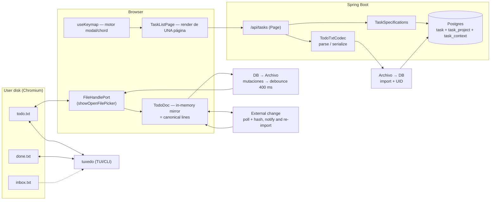

# Plan: KTLM ↔ [tuxedo](https://github.com/webstonehq/tuxedo) compatibility


> **Status: Phase 0 COMPLETE (verified by running it).** Table 0.1–0.7 was applied and
> checked against the running app. A finding from the smoke test was added on the fly:
> a body with a malformed date returned **500** and `GlobalExceptionHandler` logged
> nothing; it now returns 400 and logs the unhandled ones. See "Execution log" at the end.
Goal: to let the KTLM app (Spring Boot + React) **open a real `todo.txt` from disk**,
keep it synced both ways with tuxedo, **paginate on the server**, and expose the
**same vim/chord keybindings** as tuxedo.

Decisions already made by the user:

| Decision | Value | Main consequence |
| --- | --- | --- |
| Sync topology | Local file via the **File System Access API** (Chromium only) | The browser has no file server; the `todo.txt` lives on the user's machine. Outside Chromium a fallback mode is needed. |
| Keybinding parity | **Core + chords** | The modal/chord engine is replicated, not the whole TUI (themes, density, capture QR and the `rec:` builder stay out). |
| Pagination | **Server-side** (`Spring Pageable`) | Repository, service, controller, response DTO and the frontend cache key all have to be touched. |

> Scope note: tuxedo installed on this machine = `2026.8.1` (`/opt/homebrew/bin/tuxedo`).
> This plan was written against that binary and against the README/sources on `main`.

---

## 0. Verified facts (basis of the plan)

**tuxedo (format and behaviour reference)**

- Format: a flat line. `(A)` = priority A–Z, `YYYY-MM-DD` = creation, `+project`, `@context`,
  `key:value` (`due:`, `rec:`, `t:`, `note:`). Completed tasks carry `x ` + completion date
  at the start.
- Any unknown `key:value` **survives the round-trip**; `hide_keys` only hides it on screen.
  → it is the official slot for hanging your own metadata.
- Task numbering = **1-based line number in the file**, stable under filter/sort.
- Atomic write: writes `.tmp` and does a `rename`. On `NotFound` on disk it reloads as empty.
- External change detection: compares the **full content** against `last_disk` (not mtime).
  An external reload **erases the undo history**.
- Capture: sibling `inbox.txt` → `rename` to `.tuxedo-staging` → parse → merge → atomic write →
  staging deleted, all under an advisory lock (`*.tuxedo-lock`).
- CLI JSON output (a useful contract for validating our parser):
  `{"n":1,"raw":"...","done":false,"priority":"A","created":"2026-04-28","completed":null,
    "projects":["health"],"contexts":["phone"],"due":"2026-05-08","rec":null,"t":null}`

\*\*KTLM (current state, with exact paths)**

| Area | Current state | File |
| --- | --- | --- |
| `Task` entity | `title @Size(max=100)`, `description @Size(max=500)`, `completed`, `priority LOW/MEDIUM/HIGH`, `dueDate LocalDateTime`, `sortOrder Integer` (never read/written), `createdAt`, `updatedAt`, `userId` (a loose scalar, no FK) | `backend/src/main/java/com/example/taskmanager/model/Task.java` |
| No DTOs | The controllers return the raw JPA entity as request **and** response | `TaskController.java`, `AuthController.java` |
| Ownership | `GET/PUT/DELETE/PATCH /api/tasks/{id}` **don't check the owner**; `GET /api/tasks` falls back to `userId=1` if the JWT doesn't resolve | `TaskController.java` |
| Partial update | `TaskService.updateTask` copies **only** `title`, `description`, `completed` — it drops `priority`, `dueDate`, `sortOrder` | `TaskService.java` |
| Pagination | **Nonexistent**. `TaskRepository` only has `findByCompleted` and `findByUserId` | `TaskRepository.java` |
| Migrations | None; `spring.jpa.hibernate.ddl-auto=update` | `application.properties` |
| API client | `API_BASE` **hardcoded** to `http://localhost:8080/api/tasks`, ignores `VITE_API_URL`; `api/client.ts` is **dead code** with no importers | `frontend/src/api/tasks.ts:3`, `frontend/src/api/client.ts` |
| Query | `queryKey: ['tasks']` flat, no `staleTime`, no `keepPreviousData`, mutations only invalidate | `frontend/src/hooks/useTasks.ts` |
| Keybindings | 4 loose single-key listeners (`n`, `/`, `Esc`, a dead `1/2/3` branch), no mode, no chords, no row cursor | `frontend/src/hooks/useKeyboardShortcuts.ts` |
| Filter/search/sort | 100% client-side in a `useMemo` over the whole array | `frontend/src/pages/TaskListPage.tsx` |
| Backend tests | 1 file, 9 Mockito tests. Zero controller tests, zero security tests, zero integration tests | `backend/src/test/.../TaskServiceTest.java` |
| Frontend tests | 2 trivial files (a smoke test, a render). Playwright e2e with `if (isVisible())` everywhere | `frontend/src/**/__tests__`, `frontend/e2e/*.spec.ts` |

**Key conclusion:** the size of `title` (100) and the fact that `updateTask` drops
`priority` and `dueDate` mean that **importing a real `todo.txt` and using `p` / `r` fail
today**. Phase 0 is not optional.

---

## 1. Target architecture



**Single invariant:** `TodoDoc` (client memory) ≡ `todo.txt` content ≡ the projection onto
`task`. No operation writes in two places without going through `TodoDoc`.

**Who wins on each event** (same criterion as tuxedo's `apply_external_state`):

| Event | Winner | Action |
| --- | --- | --- |
| Mutation from the app | The app | Patch on `TodoDoc` → REST mutation → atomic flush to the file. |
| External edit (tuxedo, editor, sync) | The file | Detected by hash, the in-flight mutation is **reverted** if it wasn't applied, it is reimported and you get a warning. |
| File read error | Nobody | The write is aborted; in-memory state is preserved (an unreadable file is never overwritten). |

---

## 2. Phase 0 — Blocking cleanup

Without this, the later phases produce corrupt data or leaks.

| # | Change | File | Reason |
| --- | --- | --- | --- |
| 0.1 | Introduce `TaskRequest`/`TaskResponse` DTOs; stop exposing the JPA entity | new `dto/` | Today the client can write `userId`, `createdAt`, `id`. |
| 0.2 | Raise `title` to `@Size(max=500)` and `description` to `@Size(max=4000)` | `Task.java:20-25` | A real todo.txt body doesn't fit in 100 characters → import returns 400. |
| 0.3 | `TaskService.updateTask` must copy `priority`, `dueDate`, `sortOrder` | `TaskService.java` | Without this, `p` (priority) and `r` (reschedule) are silent no-ops. |
| 0.4 | Owner check on `GET/PUT/DELETE/PATCH /api/tasks/{id}`; drop the `userId=1` fallback | `TaskController.java` | IDOR: any authenticated user reads/edits someone else's tasks. |
| 0.5 | `dueDate`: `LocalDateTime` → `LocalDate` | `Task.java:32`, `TaskForm.tsx`, `types/task.ts` | `due:` is a civil date; the current `new Date(d).toISOString()` introduces a UTC shift. |
| 0.6 | Unify `API_BASE` into a single module and **delete** `api/client.ts` | `frontend/src/api/` | `client.ts` has no importers; `tasks.ts` ignores `VITE_API_URL`. |
| 0.7 | `@JsonIgnore` on `User.password` | `User.java` | `GET /api/admin/users` returns the BCrypt hash. |

---

## 3. Phase 1 — todo.txt domain model

### 3.1 Field mapping

| todo.txt | `Task` (target) | Note |
| --- | --- | --- |
| `(A)` … `(Z)` | `priority` | `A→HIGH`, `B→MEDIUM`, `C→LOW`, the rest `MEDIUM`. No `(x)` → `MEDIUM`. |
| `YYYY-MM-DD` (2nd position) | `createdAt` | The **date** is kept; the time is irrelevant to the file. |
| free body | `title` + `description` | The body has no real limit; hence 0.2. |
| `+project` | `task_project(project)` | `@ElementCollection`, like `User.roles`. |
| `@context` | `task_context(context)` | Same. |
| `due:YYYY-MM-DD` | `dueDate` (`LocalDate`) | |
| `rec:[+]N{d,b,w,m,y}` | `recurrence` (`String`, nullable) | Stored literally; the engine interprets it. |
| `t:±N…` | `threshold` (`String`, nullable) | Warning threshold. |
| `x ` + date | `completed` + `completedAt` | `completedAt` is **new**, nonexistent today. |
| `uid:<id>` | `uid` (`String`, nullable, uniquely indexed) | **The key of the round-trip.** |
| other `key:value` | `extras` (text) | Kept literally. |

`uid` is the critical point of compatibility: tuxedo keeps any `key:value` token, so by
writing `uid:42` on every line the file is still a valid `todo.txt` for tuxedo, and the
import back recognizes the task without duplicating. It's hidden with `hide_keys = uid`
in `~/.config/tuxedo/config.toml` (this only affects drawing; the token stays on disk).

### 3.2 No line number in the database

tuxedo's `n` is the position in the file. It isn't persisted: it's recomputed on
serialization (`TodoDoc` holds the order). `sortOrder` stops being a dead field and
becomes the **insertion order inside the file**, which is what `J`/`K` move and what
`sort = file` respects.

### 3.3 `TodoTxtCodec` (backend)

One class, `com.example.taskmanager.todotxt.TodoTxtCodec`, no dependencies:

- `List<ParsedTask> parse(String body)` — one line → `ParsedTask(priority, created, body, projects, contexts, due, rec, t, done, completed, uid, raw)`.
  Drops empty lines and `# comment` (same criterion as `drain_inbox`).
- `String serialize(List<ParsedTask>)` — fixed token order: `(P) created x completed  body  +proj  @ctx  due:  rec:  t:  uid:`.
- **Parity contract**: tests comparing against the real output of
  `tuxedo ls --json` and against a `todo.txt` generated by `tuxedo add`, pinned as test resources.

### 3.4 Endpoints

| Method | Route | Body / Query | Response |
| --- | --- | --- | --- |
| `POST` | `/api/tasks/import` | plain text `text/plain` | `{ imported, updated, skipped, tasks[] }` |
| `GET` | `/api/tasks/export` | — | `text/plain`, the user's complete `todo.txt` |
| `POST` | `/api/tasks/archive` | — | moves completed to `done.txt` (mirror of `A`) |

`import` is an **upsert by `uid`**, in a single transaction, and returns the reconciled
file so the client can write it.

---

## 4. Phase 2 — Server-side pagination

- `TaskRepository extends JpaRepository<Task, Long>, JpaSpecificationExecutor<Task>`.
- `TaskSpecifications`: `userId`, `completed`, `q` (title OR description, case-insensitive),
  `project`, `context`, `dueBefore/After`, `sortOrder` (`priority|due|file`).
- `GET /api/tasks?page=0&size=50&q=&filter=all&sort=priority&project=&context=` →
  ```json
  { "content": [TaskResponse], "page": 0, "size": 50,
    "totalElements": 0, "totalPages": 0, "hasNext": false }
  ```
- Replaces `getTasksByCompletionStatus(boolean)` (global, with no user scope) — it is
  deleted, not reimplemented.
- Frontend: `queryKey: ['tasks', params]` with `placeholderData: keepPreviousData` so the
  page doesn't flicker; `mutations` invalidate by prefix (`['tasks']`).
- `Ctrl-d` / `Ctrl-u` stop being "half a screen" of scroll and become **half a page**,
  which is what they do in tuxedo and what makes pagination meaningful.

---

## 5. Phase 3 — File mirror (File System Access API)

### 5.1 File port

`frontend/src/file/FileHandlePort.ts` with two implementations:

- `FsaFileHandle` — `showOpenFilePicker` / `showSaveFilePicker`, with the permission
  re-requested on every `queryPermission`.
- `MemoryFileHandle` — fallback for Firefox/Safari and for Playwright (which doesn't
  implement the FSA API). The UI shows an explicit warning when running in fallback
  mode: **the file is not synced**.

```ts
interface FileHandlePort {
  open(): Promise<{ text: string; write(text: string): Promise<void> } | null>
  isPersistent: boolean
}
```

### 5.2 `TodoDoc`, the mirror

A dedicated store (`frontend/src/file/todoDoc.ts`), initialized when the file is opened:

1. `text = await handle.text()`
2. `POST /api/tasks/import` → the DB is aligned; you get the reconciled file back
3. `doc = parse(textReconciled)` and `lastDisk = textFromDisk` is stored

Mutation in the app = **line patch**, not a full reserialization:

- `x` → patch the line, `POST /api/tasks/{uid}/toggle`; if the task carries `rec:`, insert
  the next instance with an advanced `due:` (same calculation as tuxedo's: with `+`
  anchored to the previous `due`, without `+` from the completion date).
- `dd` → delete the line, `DELETE /api/tasks/{uid}`.
- `J`/`K` → move the line, `PATCH /api/tasks/{uid}/move` with the target index.
- Flush **debounced 400 ms** → `handle.write(serialize(doc))` with an equivalent atomic
  write: since FSA doesn't expose `rename`, we use `createWritable({ keepExistingData: false })`
  + `write` + `close`, which is file-level atomic in Chromium.

### 5.3 External change detection

An exact replica of `apply_external_state`:

- `setInterval(400 ms)` (tuxedo uses ~250 ms when idle) → `handle.text()`.
- Hash (FNV-1a over the string) different from `lastDisk` → **reload**: reimport, refresh
  the current page, a warning `toast`, and **discard** the local undo history.
- If the file no longer exists → empty state, no crash.
- If `getFile()` fails on permissions → freeze writes and warn; never write blind.

### 5.4 Capture

Sibling `inbox.txt`: the app reads it in the same poll, applies the same `TodoDoc` merge
and returns the canonical lines. It's exactly the extension point tuxedo already exposes
(`echo "…" >> inbox.txt` from the shell, iOS Shortcuts, cron).

---

## 6. Phase 4 — Keybinding engine

Replaces `frontend/src/hooks/useKeyboardShortcuts.ts` (it's deleted, not extended).

```
frontend/src/keymap/
  actions.ts     → action names in snake_case, identical to tuxedo
  defaults.ts    → default table, a copy of the [normal] section of tuxedo's keybinds.toml
  parseToml.ts   → parser for the TOML subset ([normal], string or array of strings)
  useKeymap.ts   → state machine: mode stack + armed leader + 600 ms chord window
  KeymapProvider.tsx
```

Engine requirements:

- **Mode stack**: `normal → insert | search | visual | palette | prompt`, with `Esc` popping
  (equivalent to `escape_stack`).
- **Chords** with a 600 ms window and an indicator in the status bar (`g…`, `d…`, `y…`, `f…`).
- **Key normalization**: `event.key` → `Ctrl-n`, `Shift-Tab`, `Page-Up`, `F1`…`F24`.
- **Guards**: keys with `metaKey` are ignored; `n` doesn't fire inside an input (the
  current hook only guards `n`, and `/` and `Esc` hijack keys inside fields — a bug to fix).
- **Real config import**: an "Import keybinds" button that opens
  `~/.config/tuxedo/keybinds.toml` with the FSA. If the user already customized tuxedo,
  the web app uses **their own shortcuts** without duplicating configuration.

### Parity map (core + chords)

| Action | Key | State in KTLM today | Work |
| --- | --- | --- | --- |
| `cursor_down` / `cursor_up` | `j` `k` / `↓` `↑` | — | row cursor + `Ctrl-d`/`Ctrl-u` per page |
| `cursor_top` / `cursor_bottom` | `gg` `G` | — | chord |
| `half_page_down/up` | `Ctrl-d` `Ctrl-u` | — | pagination |
| `begin_add` | `n` | ✅ exists | reuse `TaskForm` as an overlay |
| `begin_edit_insert` / `_edit` | `i` / `e` | ❌ | `i` starts in insert, `e` in normal |
| `toggle_complete` | `x` | ⚠️ only on hover | **today the actions are `opacity-0 group-hover`** → they have to become visible to the keyboard |
| `delete` | `dd` | ❌ | chord + confirmation with `u` as the way out |
| `cycle_priority` | `p` | ❌ | depends on Phase 0.3 |
| `move_task_down/up` | `J` `K` | ❌ | `sortOrder` |
| `reschedule` | `r` | ❌ | date picker |
| `begin_prompt_context` / `_project` | `c` / `+` | ❌ | `+` isn't writable in tuxedo's TOML → same treatment |
| `copy_line` / `copy_body` | `yy` / `yb` | ❌ | `navigator.clipboard` + `textarea.execCommand` fallback |
| `undo` | `u` | ❌ | 50-level stack, client-side |
| `begin_search` | `/` | ⚠️ steals `/` in inputs | grammar for `due:±Nw`, `rec:`, `t:` + free text |
| `pick_project` / `_context` / `_saved_filter` / `save_current_filter` | `fp` `fc` `ff` `fs` | ❌ | `f` chord with 600 ms |
| `cycle_sort` | `S` | ❌ | priority → due → file |
| `toggle_visual` / `toggle_selected` | `v` / `space` | ❌ | multi-select |
| `go_list` / `toggle_archive_view` / `archive_completed` / `toggle_show_done` | `l` `a` `A` `H` | ❌ | `A` writes `done.txt` |
| `open_command_palette` | `:` `Ctrl-P` | ❌ | fuzzy matcher shared with `/` |
| `open_help` | `?` | ❌ | overlay generated from `defaults.ts` (a single source of truth) |
| `escape_stack` / `quit` | `Esc` / `q` | partial ⚠️ | |

**Out of scope by decision**: `T` (themes), `D` (density), `L` (line numbers), `s`
(capture QR), `[` `]` (sidebars), `o`/`O` (notes), the modal `rec:` builder. They're
documented as future extensions.

---

## 7. Phase 5 — Additional tuxedo features

| Feature | Where it lives | Note |
| --- | --- | --- |
| Recurrence (`rec:`) | backend `RecurrenceCalculator` | On completion, the next instance is inserted in the same transaction. `u` undoes both. |
| Natural language (`"Pay rent monthly on the first, show 3 days before due, project home"`) | `TodoTxtCodec` / `NaturalLanguageParser` | tuxedo calls it from `n` and from the `inbox.txt` drain; replicating the full grammar is expensive → **Phase 5.5, optional**: start with dates + `rec:` + `+project`/`@context`. |
| File and saved searches (`fs`/`ff`) | local `config.toml` + `localStorage` | Saved searches are `filter.<name> = <query>`, plain text. |
| `done.txt` | `archive` endpoint + FSA | Mirror of tuxedo's `A`. |
| `hide_keys = uid` | tuxedo local config | Document it in the project README. |

---

## 8. Risks

| Risk | Impact | Mitigation |
| --- | --- | --- |
| FSA API only in Chromium | Firefox/Safari can't edit the file | `MemoryFileHandle` + visible warning; the app keeps working against the API |
| FSA doesn't expose `rename` | No real atomic write | `createWritable()` is atomic in Chromium; document the difference |
| Playwright doesn't support FSA | The e2e can't test the file | `TodoDoc`/`parseKeymap` tests in vitest; e2e of the file part via `MemoryFileHandle` |
| Race between tuxedo and the web | Lost writes | Hash + reconciliation before every mutation (same as tuxedo) + warning |
| `ddl-auto=update` without migrations | Implicit new columns, no rollback | Adopt Flyway before Phase 1 |
| Growing `title` to 500 | Breaks `TaskCard` (it truncates to 1 line) | Adjust the render and the `line-clamp` |
| Current e2e with `if (isVisible())` | They never fail → they protect nothing | Rewrite the assertions when the list is touched |

---

## 9. Verification per phase

Never close a phase on unit tests alone: the proof is the running binary.

- **Phase 0**: bring up `docker compose up` + `npm run dev`; create a task with `HIGH`
  priority and a `dueDate`, edit it and confirm it persists (today it fails).
- **Phase 1**: `tuxedo add "x +p @c due:2026-12-01"` → export from `/api/tasks/export` →
  `diff` against the original file → must give **zero differences**.
- **Phase 2**: 300 tasks, walk through 6 pages with `Ctrl-d`/`Ctrl-u`, check that every
  request returns ≤ `size` items.
- **Phase 3**: open a real `todo.txt` in Chromium, edit with `x`/`dd`/`p`, and in parallel
  run `watch -n 0.5 cat todo.txt` to see the write; then edit from `tuxedo` and check the
  reload warning.
- **Phase 4**: walk through the parity table key by key with the real driver.
- **Phase 5**: `x` on a task with `rec:+1m` → check the next line and that `u` undoes
  both.

---

## 10. Execution order

```
Phase 0 (cleanup)  ── blocks everything
   │
Phase 1 (model + codec + import/export)  ── blocks real interoperability
   │
Phase 2 (pagination)  ── independent of 1, can overlap
   │
Phase 3 (file mirror)  ── needs 1
   │
Phase 4 (keymap)  ── needs 3 (chords depend on the cursor row) and 2 (Ctrl-d/u)
   │
Phase 5 (recurrence, done.txt, natural language)  ── optional
```

Surface estimate: Phase 0 ≈ 7 files touched; Phase 1 ≈ 10 new + 4 modified;
Phase 2 ≈ 6; Phase 3 ≈ 7 new; Phase 4 ≈ 8 new (including deleting the current hook);
Phase 5 staggered.

---

## 11. Open questions (they don't block the start)

1. Should the web app **also write** `done.txt`, or does `A` stay an operation exclusive
   to tuxedo with the web only reading?
2. Is `uid:` always written, or only when the file already came from another source (so
   as not to contaminate a user's `todo.txt` on the first save)?
3. Is Flyway adopted in Phase 0, or is `ddl-auto=update` accepted during development and
   migrated at the end?

---

## 12. Execution log — Phase 0

Applied and verified against a local Postgres 18 + the backend on :8080 + Vite on :5173,
with the real app driven in Chromium. Test database created and deleted when finished.

| Change | Verification observed |
| --- | --- |
| `title` 500 / `description` 4000 | `varchar(500)` in the generated schema; a 250-character POST → `201` |
| `TaskRequest` / `TaskResponse` | `userId:999` and `createdAt:1999-…` in the payload → the response carries the server's `createdAt` and the resource belongs to the real owner |
| Partial `updateTask` | A `PUT` with only `title` returned `priority:"HIGH"` and `dueDate:"2026-12-01"` untouched. **Repeated through the UI**: editing only the title left the card at `Alta` / `1 dic` |
| Ownership on `/{id}` | Bob against Alice's task 1: `GET/PUT/DELETE/PATCH` → `404` on all four. Separate per-user lists |
| `dueDate` to `LocalDate` | `2026-10-06` created from the UI renders as **"Mañana"** after a reload, not "Hoy" — no UTC shift |
| Single `API_BASE` | `api/client.ts` deleted (0 importers); `tasks.ts` and `auth.ts` use `api/http.ts` and respect `VITE_API_URL` |
| `@JsonIgnore` on `password` | `GET /api/admin/users` no longer includes the field |
| *Smoke finding* | Malformed date `61007-02-20` → a silent **500**. Now `400 {"error":"Bad Request"}`; `GlobalExceptionHandler` logs the unhandled ones |

Tests: backend 14/14 (`TaskServiceTest` rewritten with coverage for partial payloads and
cross-owner access), frontend 4/4, `npm run build` OK.

### Debt noted, not resolved

- `useTasks` has no `onError`: a `400` is swallowed without a toast. It doesn't affect
  correctness, but in Phase 3 the file watcher needs failures to be visible.
- ~~`ddl-auto=update` without Flyway~~ → resolved in Phase 1 (see §13).
- The Playwright e2e still use `if (isVisible())` in every assertion.

---

## 13. Execution log — Phase 1

### Flyway

Adopted. `V1__baseline.sql` reproduces the schema `ddl-auto=update` used to leave;
`V2__todotxt_columns.sql` adds the todo.txt fields, the project and context tables, the
`user_id` index and the partial unique index on `todo_uid`.
`baseline-on-migrate=true` + `baseline-version=1` leaves pre-existing databases at V1, so
they only run the new stuff. `ddl-auto` switches to `validate`: Hibernate checks, Flyway
commands.

Verified on an empty database: `Successfully validated 2 migrations` → `Migrating to "1 - baseline"`
→ `Migrating to "2 - todotxt columns"` → `Schema is up to date` on the next boot.

### Interop test against the real binary

A file written by hand, imported, exported, and the export fed through `tuxedo ls --json`.

| Step | Result |
| --- | --- |
| `POST /api/tasks/import` of 4 lines | `imported: 4, updated: 0` |
| `GET /api/tasks/export` | 4 lines with `uid:` assigned, `rec:`, `t:`, `note:` and `+project`/`@context` intact |
| `tuxedo ls --json` on our export vs. on the original | `done`, `priority`, `created`, `completed`, `projects`, `contexts`, `due`, `rec`, `t` match on all 4 tasks |
| Reimporting our own export | `imported: 0, updated: 4` — no duplicates |
| `tuxedo do 1` + `tuxedo add` on the file → reimport | `imported: 1, updated: 4`; the `x` arrives as completed and the new one as a task with `rec:+2w` |
| `POST /api/tasks/archive` | `archived: 1`, `doneFile` with the `x …` line; `tuxedo lsa` on `todo.txt` + that `done.txt` gives `total: 5 of 5` |

#### The two round-trip differences, and why they're correct

1. **`@ctx +proj` is sorted as `+proj @ctx`.** The format doesn't distinguish order
   between tags.
2. **Lines without a creation date get the import date.** That's exactly what tuxedo's
   `inbox.txt` drain does ("given a creation date if missing").

Otherwise the exported file is the same file, plus the `uid:`.

#### Fix applied during the smoke

The first version exported `(B)` on every `MEDIUM` priority task, which dirtied every
line of the user's `todo.txt`. `MEDIUM` is the default state and the domain has no
"no priority", so now `MEDIUM` emits no priority and only `HIGH`→`(A)` and `LOW`→`(C)`
are written. Checked against tuxedo: its `add` doesn't emit a priority marker by default
either.

Tests: backend 30/30 (16 of the codec, 14 of the service), frontend 4/4, build OK.

### Pending for Phase 2

- `GET /api/tasks` still returns the full list: `/import` and `/export` work on the whole
  set, which is correct for a file. Pagination arrives in Phase 2 and must not touch
  these two endpoints.

---

## 14. Execution log — Phase 2

### Backend

`TaskRepository` extends `JpaSpecificationExecutor<Task>`; `TaskSpecifications`
centralizes the predicates. The per-user scope lives in `ownedBy(userId)` and **there is
no way to ask for the list without it**: it's the first element of the composition, not
an optional parameter.

`TaskSort` implements `toOrder(cb, root)` over the criteria tree instead of using Spring
Data's `Sort`, because priority needs a conditional expression that `Sort` can't
express (the enum is stored by name, so alphabetical order doesn't work). `due` relies on
PostgreSQL sorting NULL above everything, so `ASC` leaves dateless tasks at the end.

`@BatchSize(50)` on `projects` and `contexts`: without it, pagination is an N+1 (two
EAGER collections per task).

`GET /api/tasks/completed/{completed}` and `TaskService.getTasksByCompletionStatus` are
removed: `filter` pagination replaces them, and the old route had no owner scope by
design.

### Smoke with 300 tasks

| Check | Result |
| --- | --- |
| 6 pages of 50 | 50/50/50/50/50/50, **300 unique ids**, correct `hasNext`/`hasPrevious` at the extremes |
| `page=6` (out of range) | `content: []`, `totalPages: 6` |
| `size=100000` | Capped at 200 |
| Isolation between users | Bob (1 own task) sees none of Alice's 300 |
| `q` | `Tarea numero 042` → 1; `tarea NUMERO 100` → 1 (case-insensitive); `no existe` → 0 |
| `project` | `alpha` → 150, `beta` → 150 |
| The six sort orders | A controlled dataset where each one gives a different order: file = insertion, priority = `Zeta(HIGH), Mango(MEDIUM), Alfa(LOW)`, due = `Mango, Alfa` and the two dateless ones at the end, newest/oldest reversed, alphabetical |
| `/counts` | Alice `{"all":300,"active":300,"completed":0}`, Bob `{"all":1,...}` |

### Frontend

`useTasks(params)` with `queryKey: ['tasks', params]` and `placeholderData: keepPreviousData`;
the counters go in their own `['task-counts']` query because with pagination they can no
longer be computed client-side. The two `useMemo`s for filtering and sorting disappeared
from `TaskListPage`.

Verified in Chromium against the real backend:

- `mostrando 1–20 de 300`, `página 1 de 15`, 20 cards on screen.
- "Siguiente" → `mostrando 21–40 de 300`, request `?page=1`.
- Switching to "Pendientes" while on page 2 → goes back to `página 1`.
- Debounced search: typing → `?q=Tarea+numero+04`, one character less → refetch.
- The defaults **don't travel**: the real requests are `?page=1`, `?filter=active`, `?q=...`.

Tests: backend 33/33, frontend 6/6, build OK.

### Note on a smoke false positive

Filling the search field with the empty string from the automation script left the list
frozen on the previous result. It's not an app bug: the harness sets `.value` without
dispatching the event React needs. With real keystrokes (backspace until the field is
empty) it does refetch, and it was confirmed that the list shows the 20 tasks again.

### What's left for Phase 4

`Ctrl-d` / `Ctrl-u` can now be mapped to half a page: the endpoint exposes `page`, `size`,
`hasNext` and `hasPrevious`. The keymap engine is what's missing (Phase 4).

---

## 15. Execution log — Phases 3 and 4

### Phase 3: the file mirror

`FileHandlePort` wraps Chromium's File System Access API and falls back to an in-memory
implementation outside it and in tests; the UI says when it isn't syncing. `TodoDoc`
holds the mirror (lines, header, uids, cursor, selection, 50-step history) and mutations
patch lines instead of reserializing the whole file.

The comment header is kept separately: the backend doesn't know about `#`, and without
this a save would lose the header block of the user's `todo.txt`.

#### Four bugs that only appeared when running against a real file

1. **Reimport loop.** The hash was compared against the *reconciled* file instead of what
   was read from disk, so the poll saw a difference on every pass and imported endlessly,
   duplicating tasks. Now the hash is of the text that was read.
2. **Duplicates on reopen.** On linking, the reconciled file wasn't written back, so the
   `uid:` never reached disk and every reopen created the tasks again. Now linking
   schedules a flush.
3. **The poll undid local edits.** A patch marks the hash invalid, and the next tick read
   the old file, took it for an external change and reverted what the user had just
   written. Added `isWritePending()`: while a write is in progress the poll doesn't
   reconcile.
4. **Repeated `uid:`.** When completing a recurring task, tuxedo inserts the next instance
   keeping the same `uid:`. A single row can't represent both: the second occurrence
   created a new task with its own uid. Pinned with a test.

On top of that, `TodoFileBar` mounted its own `useTodoFile()`, so there were two polls
and two writers competing for the same file. The bar is now presentational.

### Phase 4: the keybindings

`keymap/` has four layers: `actions.ts` and `defaults.ts` (tuxedo's table, literal),
`parseToml.ts` (the subset of `~/.config/tuxedo/keybinds.toml`) and `useKeymap.ts` (the
engine: key normalization, chords with a 600 ms window, mode stack). `HelpOverlay` is
generated from the same table that runs the engine, so there's no second source of truth.
`useKeyboardShortcuts.ts` ends up deleted: four loose listeners replaced by the engine.

#### Walkthrough verified with a real keyboard, against disk

With a 4-line `todo.txt` opened from the browser:

| Key | Observed effect |
| --- | --- |
| `j` `k` | The cursor moves from "Call dentist" to "Pay rent" |
| `g` `g` | The `g…` indicator appears in the bar and `gg` returns to the first row |
| `G` | Last row |
| `x` | Counters `Completadas 0 → 1`; in the file `x 2026-10-05 (A) 2026-04-28 Call dentist…` |
| `p` | Priority `Media → Alta`; `(A)` appears in the file |
| `J` | The task moves down; its order changes in the file |
| `d` `d` | `Todas 4 → 3` |
| `u` | `Todas 3 → 4`, the row goes back to the base |
| `?` | Opens the overlay with the chords (`gg`, `dd`, `fp`) and modifiers (`Ctrl-d`) |
| `Esc` | Closes the overlay |

At the end, `tuxedo ls` on the file written by the browser returns the four tasks with
their `uid:`s intact.

#### Two more bugs the smoke found

- `pushLineOrder` sends a `PUT` with only `sortOrder`, and `@NotBlank` on the title
  rejected it with a 400 on every task. The title became optional in `TaskRequest` and the
  requiredness is enforced by the service on create, with `InvalidRequestException` → 400.
- `cyclePriority` wrote tuxedo's letter (`A`) where the enum expects `HIGH`. There's now
  an `A→HIGH, B→MEDIUM, C→LOW` table.

Tests: backend 39/39, frontend 66/66 (26 of the engine, 19 of the data layer, 15 of the mirror).

### What was left out, and why

- ~~**The frontend has no typecheck.**~~ → resolved in §16.
- `inbox.txt`: the backend resolves it through `/import`, but the automatic drain from
  the sibling file isn't wired up in the client.
- Out of scope by decision, as planned: themes (`T`), density (`D`), line numbers (`L`),
  capture QR (`s`), sidebars (`[`/`]`), notes (`o`/`O`), the modal `rec:` builder and the
  command palette (`:`), which is wired to a key but opens nothing.

---

## 16. Execution log — frontend typecheck

What the previous section left as pending is now resolved.

`@types/react@18`, `@types/react-dom@18` and `@types/node` installed, `frontend/tsconfig.json`
added and `npm run typecheck` green. The typecheck is also in
`.github/workflows/ci-cd.yml`, right after `npm ci`, so nobody can quietly drop it.

**It was 16 errors, not hundreds.** The avalanche I saw the first time came from
`@types/react` not being installed: without it, every JSX errored and the count meant
nothing. With the types in place, the real scope is manageable.

### What it uncovered

| Error | What it was |
| --- | --- |
| `Timeout` not assignable to `number` (×4) | When `@types/node` was added, `setTimeout` started returning Node's `Timeout` and stopped shadowing the DOM's `number`. This is browser code: it now uses `window.setTimeout` / `window.clearTimeout`, and `0` as a sentinel instead of `null`, which didn't fit the signature either |
| `TaskCard.test.tsx`: module not found | The import path was `../../types/task` from `__tests__/`, one level short |
| `useTasks.test.tsx`: `'active'` not assignable to `'all'` | `initialProps` inferred the literals from the object and `rerender` couldn't widen them. The prop is now annotated as `TaskQueryParams` |
| `Plugin<any>[]` not assignable to `PluginOption` | vitest 2 dragged in its own copy of **vite 5** while the project uses vite 6. Upgraded to vitest 3, which dedupes |
| `statements` doesn't exist in `coverage` | Key moved in vitest 3: it's now `coverage.thresholds.statements` |
| `isFocused` and `ArrowRightOnRectangleIcon` unused | Dead code deleted, not silenced |

### A Phase 3 defect that surfaced when verifying at runtime

After a reload caused by an external change, the comment header of the `todo.txt`
disappeared: the preamble was taken from the **reconciled** file, and the backend doesn't
know about `#`. Now it comes from the text read off disk. Verified: with
`# Tareas del proyecto` and `# Bloque personal`, tuxedo adds a task and changes its
priority, and both lines are still there after the full cycle.

### Known, measured limitation

A line **without `uid:`** always creates a new task: there's no identity to recognize it
by. That means that if tuxedo adds a task and edits the file again before the app writes
the `uid:`s back, that task is duplicated on reimport.

Once the app writes, the cycle is stable. Measured: a file with the three lines carrying
`uid:`, imported three times in a row, gives `3/0`, then `0/3`, then `0/3` — three rows,
zero duplicates. The trigger is concrete and documented; the underlying fix would be the
advisory lock tuxedo itself uses when draining `inbox.txt`.

### Status

Backend 39/39, frontend 66/66, clean `typecheck`, build OK.
---

## 17. Execution log — wrap-up

### Shortcuts off without a file

`useKeymap` accepts `unavailable: { actions, reason }` and ignores them. Without a linked
todo.txt, `x`, `p`, `J`, `dd` and `u` have no uid to act on; until now they exited via
the early return, silently. Now the header says so and the overlay lists them struck
through with the reason.

The double write path was discarded (mutate the file if there is one, otherwise the API):
it forces you to decide which of the two wins when both are available, which is the hard
part.

### Recurrence, palette and inbox

- `r` opens the prompt to write `rec:`. The spawn was already there; being able to type
  it was missing.
- `:` and Ctrl-P open the palette, with tuxedo's ranking: tag start, word boundary,
  inside. Across forty commands position is the ranking.
- To read `inbox.txt` the **directory** was needed, not the file: the File System Access
  API returns a handle without saying where it is. The picker asks for a folder and
  `todo.txt` and `inbox.txt` come out of it. It's drained on every poll and emptied
  **before** importing: emptying afterwards would leave the lines there for the next pass.

### Debt of the lines without uid: resolved

A line without `uid:` has no identity, so it always created a new task. Now, if there's
no uid, it looks up by content and **only matches if the hit is unique**: with two
identical tasks there's no guessing. Dates are left out of the key, because the creation
date is sealed by the server and a tuxedo line may not carry it.

Checked against Docker: importing a uid-less file twice gives 2 rows; before, 3.

### Rewritten e2e

Hermetic (they intercept the API) and with web-first waits. Three traps came up along the
way that are worth not stepping in again:

1. The `**/api/tasks**` glob also caught the dev server's own module (`/src/api/tasks.ts`)
   and replaced it with a `{}` that left the app blank. Now it's a path predicate.
2. The session fixture wasn't mounted in the tests that didn't ask for it by name, so
   they really did hit the real backend.
3. The app is a PWA: without `serviceWorkers: 'block'` the tests assert against the
   cached index, not against the build on disk.

Plus a check that the suite bites: deliberately breaking `cursor_down` makes the e2e for
`j` and `k` fail. That's the difference between having tests and having assertions.

### Still out of scope, and why

- **Sidebars (`[` and `]`).** Tuxedo has a side panel with the task detail and another
  with filters. On the web the detail is already in the card and the filters are the tabs
  at the top. Adding them would duplicate in a panel what's already on the page, and the
  shortcut can't be left bound to nothing: if `toggle_left_pane` does nothing, that's
  exactly the fake-working shortcut we just removed under option B. Either the panel gets
  built, or the key stays unbound. Tell me which and I'll do it.
- **Notes (`o` and `O`).** They link `note:<path>` to a file and open it in `$EDITOR`.
  The web has no editor and no file system; emulating it with downloads and
  `<textarea>` isn't the same as the function. It needs a product decision that isn't
  written down anywhere.

### Status

Backend 41/41, frontend 58/58, e2e 17/17, clean `typecheck`, e2e in CI.
